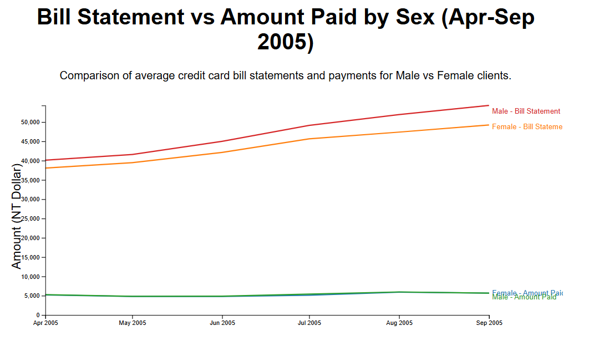

# Bill Statement vs Amount Paid Visualization

This project presents a D3.js line chart visualization that compares the average credit card bill statements against the amounts actually paid by male and female clients from April to September 2005. Derived from the "Default of Credit Card Clients" dataset (UCI ML Repository), the visualization highlights trends in financial behavior, allowing viewers to analyze how payment patterns differ between genders relative to their billed amounts over the observed six-month period.

[Click here for the Visualization](https://gopinathh22.github.io/iv-assignment-3/)

